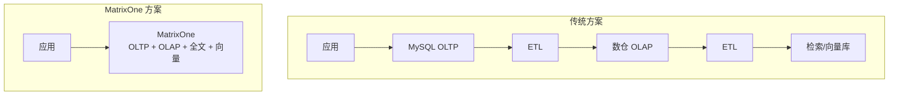
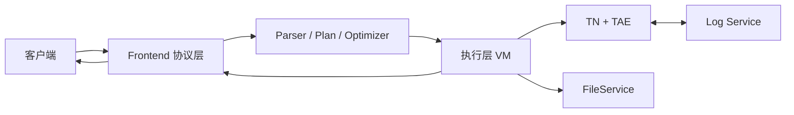
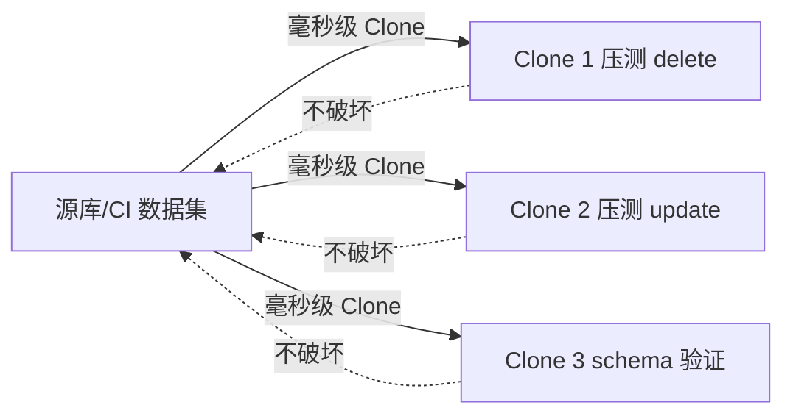
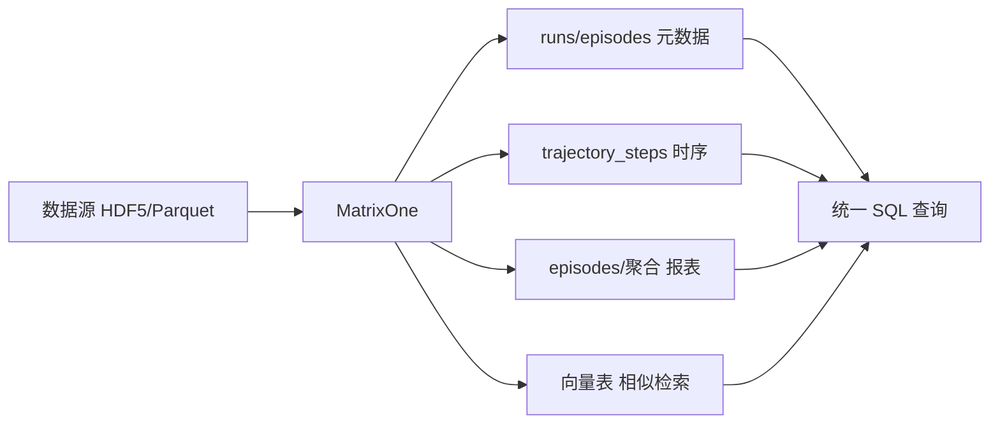

# MatrixOne 数据库技术架构及原理介绍

---

## 一、MatrixOne 是什么

MatrixOne 是**业界首个将 Git 风格版本控制引入数据库**的 HTAP 数据库，同时具备 **MySQL 兼容**、**AI 原生**和**云原生**架构。

- **HTAP**：在同一个系统里同时支撑事务（OLTP）和分析（OLAP），无需两套库、无需 ETL。
- **HSTAP 引擎**：在 HTAP 基础上进一步融合**全文检索**和**向量检索**，形成「超融合」单一引擎——OLTP + OLAP + 全文 + 向量，一套数据、一套系统。
- **极简架构处理多模数据**：用一套极简架构统一承载关系、全文、向量等多模数据，**减少甚至无需 ETL**，**强一致性**（单一数据源、无多库同步延迟），**低成本**（无重复存储、无多套同步管道、运维简单）。

传统方案往往需要 MySQL + 数仓 + ES + 向量库，多套系统、多套 ETL、数据不一致、运维复杂。MatrixOne 用**一个数据库**覆盖这些场景，并提供**类 Git 的数据版本能力**，是当前市面上少有的组合。

---

## 二、整体技术架构

### 2.1 架构总览

MatrixOne 采用**存算分离、多角色分布式**架构，主要包含三类服务：

| 角色 | 英文 | 职责简述 |
|------|------|----------|
| **计算节点** | CN (Compute Node) | 接收 SQL、解析与优化、执行查询、无状态，可水平扩展 |
| **事务/存储节点** | TN (Transaction Node) | 事务协调、数据持久化、存储引擎（TAE）所在，负责写路径与持久化 |
| **日志与协调** | Log Service | 分布式日志、元数据与协调（如 HAKeeper），保证一致性、高可用与选主 |


**请求大致路径**：客户端通过 MySQL 协议连接任意 CN → CN 解析、优化、生成执行计划，通过 RPC 与 TN、Log Service 交互 → TN 负责事务提交、日志落盘、数据写入存储引擎；读路径上 CN 从 TN/对象存储拉取数据块 → 存储可挂载对象存储（S3/MinIO），存算分离。**CN 负责算，TN 负责事务与存储，Log Service 负责日志与协调**，三者协同完成一条 SQL 从进入到落库/返回结果的全过程。

**协议与部署**：对外兼容 **MySQL 8.0** 协议与常用语法，现有 MySQL 驱动、ORM、管理工具可直接使用；架构上**云原生**、存算分离，支持 Kubernetes 部署与计算/存储独立弹性扩展，便于在云上或本地统一运维。

**权限与安全**：提供**完备的权限控制**，包括 **RBAC**（基于角色的访问控制）和 **Row-level access**（行级访问控制）。当 Agent 或应用代表用户操作数据时，需要细粒度、可审计的权限边界，RBAC 与行级访问对「AI Agent 安全接入数据库」非常重要。

### 2.2 与「传统 MySQL + 数仓」的对比



传统方案：多套系统、多份数据、多条同步管道，一致性难保证，存储与运维成本高。MatrixOne：**极简架构**，一套协议（MySQL）、一套数据、一套运维，多模数据在一处处理，减少甚至无需 ETL，强一致性、低成本。

---

## 三、核心原理

### 3.1 存储与执行

- **存储引擎（TAE）**：面向 HTAP 的**列式存储**，采用 LSM 风格的多层结构（如 L0/L1/L2），支持高吞吐写入与分析型扫描，同时保证事务语义（ACID）。
- **执行模型**：**向量化执行**（按列、按批处理），利于 CPU 缓存与 SIMD，适合分析型查询；事务路径与 TN 配合，保证可见性与隔离性。
- **存算分离**：数据最终落在**对象存储**（或本地盘），CN/TN 可按需扩缩容，存储容量与计算能力解耦，适合云上与弹性场景。

### 3.2 分布式与一致性

- **日志**：关键元数据与事务日志通过 **Log Service** 复制与持久化，支持高可用与故障恢复。
- **事务**：分布式事务由 TN 与 Log Service 协同，保证跨分片、跨 CN 的 ACID。
- **多 CN**：多个 CN 无状态，可挂负载均衡；TN 负责同一份数据的写入与持久化，读请求可由不同 CN 执行，实现**读扩展**。

---

## 四、模块划分与协同逻辑

从「一条 SQL 进来」的视角，模块配合关系如下：



1. **接入层（Frontend / 协议）**  
   接收 MySQL 协议，鉴权、会话管理。可使用现有 MySQL 驱动、ORM、工具连接，接入成本低。

2. **SQL 层（Parser / Plan / Optimizer）**  
   解析 SQL → 语义分析 → 逻辑计划 → 优化 → 物理计划。支持 MySQL 语法与常用扩展，便于从 MySQL 迁移或双写对比。

3. **执行层（Execution / VM）**  
   按物理计划在 CN 上执行：扫描、连接、聚合等，部分下推到 TN 或通过 RPC 拉取数据。向量化执行器 + 列存，适合复杂分析查询。

4. **事务与存储（TN + TAE）**  
   TN：事务管理、提交、日志；TAE：块/段/表组织、压缩、索引（如主键、ZoneMap 等）。写路径由 CN 与 TN 协同（事务提交、日志落盘）；读路径按快照读取，保证隔离性。

5. **日志与协调（Log Service）**  
   存储日志、元数据；HAKeeper 等负责调度、选主、健康检查。保证集群一致性与高可用，对业务透明。

6. **文件与对象存储（FileService）**  
   统一抽象本地盘/对象存储，TAE 及备份等依赖于此，为存算分离、弹性扩容打基础。

7. **数据接入与集成**  
   **外表（External Table）**：从对象存储或本地文件指定路径直接查询/导入；**Stage**：创建指向对象存储（如 S3）的 Stage，用于批量 LOAD DATA；**DataLink**：一种列类型，在表内存储指向外部文件/对象的链接（URL 或 MO 路径），支持按需读取并解析（如 PDF、DOCX 转文本），适合多模态或文档场景。

可简单理解为：**CN 算、TN 存与事务、Log 保一致**，其余对应用透明。

---

## 五、MatrixOne 的独特亮点

### 5.1 Git for Data——像管代码一样管数据

MatrixOne 将「Git 式版本控制」做到数据库层面，其中 **Clone（即时克隆）** 是核心能力之一，在性能测试、多环境隔离、数据沙箱等场景中可直接受益。



#### 为什么 Clone 是重中之重

- **毫秒级即时克隆**：基于快照的克隆在毫秒级完成，零拷贝、几乎不额外占用存储，得到一份与源库一致的可写副本。
- **数据沙箱、不破坏原数据**：克隆体与源数据隔离，在克隆库上做大批量 delete、update、压测或试跑，**不会动到原始数据集**。传统做法要么反复恢复备份、要么复制整库，成本高、耗时长。
- **构造数据集成本高，Clone 可复用**：真实/CI 数据集往往需要复杂 ETL 或长时间积累，构造成本很高。用 MatrixOne 时，**一份 CI 数据集可毫秒级 clone 多份**：例如一份做 delete 性能测试、一份做 update 性能测试、一份做 schema 变更验证，互不干扰，无需重复造数。适用于性能回归、多团队并行开发、多场景验证。

更多说明可参考官方教程：[多团队开发即时克隆](https://docs.matrixorigin.cn/en/v25.3.0.2/MatrixOne/Tutorial/efficient-clone-demo/)、[生产环境安全升级与即时回滚](https://docs.matrixorigin.cn/en/v25.3.0.2/MatrixOne/Tutorial/snapshot-rollback-demo/)。

#### 其他 Git for Data 能力

- **即时快照**：毫秒级一致性快照，零拷贝、无存储膨胀，用于某一时刻的只读视图或克隆的基底。
- **时间旅行**：按时间戳/快照查询历史数据，对账、审计、回溯分析。
- **分支与合并**：在独立分支上做 schema 变更、数据迁移或大批量试跑，不影响主库，再按需合并。
- **即时回滚**：结合快照与日志回滚到历史状态，无需全量备份恢复。
- **审计追踪**：变更历史可追溯，合规与排障。

**AI 时代：Agent 操作数据的风险与防护**  
AI Agent 直接操作生产或敏感数据存在误删、误改、越权等风险。MatrixOne 可提供防护：用 **Clone/沙箱** 给 Agent 一个隔离副本再操作、用**快照**固定某一时刻视图、用 **PITR**（按时间点恢复）和**回滚**在出问题时快速恢复。权限上有 RBAC 与行级访问控制，数据上有沙箱、快照、PITR、回滚，形成「谁能在什么范围操作」+「操作错了能兜底」的组合，适合把 Agent 安全地接到数据库场景。

**适用场景**：性能测试与回归（clone 多份分别测 delete/update/混合负载）；数据订正前先快照或开分支试跑；需要「查某一历史时刻数据」的报表或对账；用快照+回滚替代重备份恢复；AI Agent 在沙箱/克隆环境中试跑，或通过快照/PITR/回滚兜底。这些在传统 MySQL 上往往需要自建多套系统才能实现。

---

### 5.2 极简架构处理多模数据，一个库替代多套系统（HSTAP）

用**极简架构**统一处理关系、全文、向量等多模数据——OLTP + OLAP + 全文检索 + 向量检索在一套引擎、一套数据上完成。

- **减少 / 无需 ETL**：事务数据写入即可被分析、全文检索、向量搜索使用，无需在 MySQL → 数仓 → ES → 向量库之间反复抽取、转换、同步。
- **强一致性**：单一数据源、单一事务语义，分析结果与业务数据实时一致，无多库同步延迟与最终一致性问题。
- **低成本**：无重复存储、无多套同步管道、一套部署/监控/备份策略，人力和资源成本都更低。
- **架构极简**：多模数据一种协议（MySQL）、一个连接、一套运维，只需面对一个系统而不是「OLTP 库 + 数仓 + 检索库 + 向量库」的组合。

**多模态流水线示例（RLDS/轨迹类）**

**场景**：具身智能、机器人、自动驾驶等场景会产生大量**轨迹数据**（按 episode→step 组织，每 step 可能包含 observation、action、reward 等多模态字段），原始数据通常落在 HDF5/Parquet 或对象存储。业务上需要：能按设备/场景/时间**找到**某条轨迹、能看**趋势与异常**、能做**质量与成功率报表**、能「**找和某条轨迹类似的历史轨迹**」做复盘或模仿学习。整条链路涉及**元数据索引、时序监控、分析报表、向量相似检索**四个环节，传统上往往用多套数据库分别承担，现在**只需要 MatrixOne 一个库**就能串联。



**每一步的实际意义与做法**：

| 步骤 | 实际意义（为什么需要这一步） | 这一步具体做什么 | 传统方案通常需要哪些数据库 | 现在 |
|------|------------------------------|------------------|----------------------------|------|
| ① 元数据与索引 | 原始文件动辄百万级，不能靠文件名找；需要按设备、场景、时间、成功率等**筛选轨迹**，并**反查文件路径**（溯源、抽样、报表）。 | 把 run/episode 级元数据（路径、设备、场景、步数、成功与否等）落库建索引，支持条件查询与「根据 episode_id 查对应文件路径」。 | MySQL / PostgreSQL 等 OLTP | **只需 MatrixOne**：runs、episodes、files 等表，SQL 直接查、关联定位文件。 |
| ② 时序监控 | 要看到**随时间变化的趋势**（如每小时/每日的 step 数、reward 分布）或做**异常检测**，需要把 step 级数据按时间窗口聚合。 | 把 step 级数据（timestamp、reward、步长等）写入时序表，按时间桶做聚合查询（如 FLOOR(timestamp)、COUNT/AVG）。 | TimescaleDB / Prometheus / ClickHouse 等时序或分析库 | **只需 MatrixOne**：trajectory_steps 等表，同一库里按时间桶聚合、做趋势与异常分析。 |
| ③ 分析与报表 | 要做**质量报表、异常比例、成功率统计**等，需要基于 episode/step 的聚合指标（如平均质量分、异常条数、按 run 汇总）。 | 计算 path_length、quality_score、anomaly 等指标，写入 episodes 或聚合表；用 SQL 做多维汇总、对比、TopK。 | ClickHouse / BigQuery / Snowflake 等数仓 | **只需 MatrixOne**：episodes/聚合表，同一库里跑报表 SQL，无需再导到数仓。 |
| ④ 相似检索与轨迹检索 | **找和某条轨迹类似的历史轨迹**（复盘、模仿学习、根因分析），或**按条件筛一批轨迹**，需要向量相似度召回 + 关系条件过滤。 | 把轨迹编码成 embedding 写入向量表并建 HNSW/IVF 索引；检索时先向量 TopK，再按 episode 属性过滤，或直接按条件查轨迹列表。 | Milvus / pgvector / Faiss + 关系库 组合 | **只需 MatrixOne**：向量表 + 关系表在同一库，SQL 里同时做相似度与条件过滤，无需多库拼接。 |

**总结**：同一份原始数据只落一次（文件/对象存储），派生出的元数据、时序、报表、向量**全部进 MatrixOne**，查询层统一用 MatrixOne SQL。传统需要多套数据库才能完成的「元数据 → 时序 → 报表 → 向量检索」，**现在只需要 MatrixOne 就可以**，一套协议、一套运维、一条数据血缘。

**适用场景**：新业务或新模块若同时有「高并发写入 + 复杂分析 + 关键词/全文搜索 + 向量相似度」需求，或多模态流水线（如轨迹/RLDS）需要元数据、时序、报表、向量检索多种能力，可用 MatrixOne 统一承载，获得强一致与低成本，减少系统数量和集成复杂度。

---

### 5.3 AI 原生：向量 + 全文，直接做 RAG/搜索

内置向量类型与索引（如 IVF、HNSW）以及全文检索，无需单独部署向量库或 ES 即可做语义搜索与 RAG。

- **向量类型与索引**：如 `VECF32` + IVF/HNSW 索引，支持相似度搜索（如余弦、L2）。
- **全文检索**：支持布尔检索、自然语言检索等，可与向量组合成**混合搜索**（关键词 + 语义）。
- **应用形态**：RAG、推荐、问答、多模态检索等，都可以在数据库内完成「存 + 检」，减少应用与多系统之间的胶水代码。
- **Agent 与权限、数据安全**：架构层提供 **RBAC + Row-level access**，适合 AI Agent 按最小权限访问数据；Agent 操作有风险时，可用**沙箱、快照、PITR、回滚**在隔离环境试跑或出问题后快速恢复，形成「权限控边界 + 数据可兜底」的 Agent 用数方案。

**适用场景**：RAG、智能问答、推荐、以图搜图等需要「向量 + 关系数据」或「全文 + 向量」的场景；若由 AI Agent 执行写操作，可结合权限控制与沙箱/快照/PITR/回滚，在保证安全的前提下验证效果。

---

### 5.4 数据集成、发布/订阅与备份 / 跨集群同步

与对象存储和外部文件的集成简单（外表、Stage、DataLink 列类型）；支持**发布（Publication）/ 订阅（Subscription）**做同集群与跨集群的账户级数据共享；物理备份简单；跨集群同步支持 MO-CDC、Flink CDC 及特有的 diff + 远端 apply diff 能力，方便多集群、多区域数据流动与容灾。

#### 集成能力

- **外表（External Table）**：通过 `infile` 或 `URL s3option` 指定对象存储/本地路径，直接查询或导入数据，无需先入库，适合湖仓一体、冷热分离。
- **Stage**：`CREATE STAGE ... URL='s3://...'` 创建指向对象存储的 Stage，配合 `LOAD DATA ... FROM stage` 做批量导入，与 ETL 流程衔接。
- **DataLink**：一种**列类型**（如 `datalink`），在表内存储指向外部文件/对象的**链接**（URL 或 MO 路径）；引擎支持按需读取内容并解析（如 PDF、DOCX 转文本），适合「表里存链接、按需拉取」的多模态或文档场景。

可用外表 + Stage 把数据从对象存储「拉进来」；用 DataLink 列在表中引用外部文件并做解析，减少自研 ETL。

#### 发布 / 订阅（Publication / Subscription）

- **含义**：发布方账户将指定库/表通过 `CREATE PUBLICATION ... DATABASE ... TABLE ... ACCOUNT ...` 共享给指定账户；订阅方账户通过订阅获得对这些数据的访问权限。
- **同集群**：同一集群内多账户之间共享库/表，无需拷贝数据。
- **跨集群**：支持跨集群的订阅与数据同步，用于多区域、多活或灾备场景下的数据共享与一致性。

与 CDC、跨集群同步配合，可形成「谁可以看哪些库表」+「变更如何同步到 MySQL/另一集群」的完整方案。

#### 物理备份与跨集群同步

- **物理备份**：提供**非常简单的物理备份**（如 `backup ... s3option ...`，支持全量/增量），便于本地或跨区域恢复、克隆与迁移。
- **跨集群同步机制**：  
  - **MO-CDC**：MatrixOne 内置 CDC，将源集群变更实时同步到 **MySQL 5.7+ / 8.0+** 或**另一套 MatrixOne 集群**（inter-cluster），支持库/表级与时间范围控制。  
  - **Flink CDC** 等：与生态兼容，可与 Flink、Kafka 等组成实时同步链路。  
  - **特有的跨集群 Data Sync**：基于 **diff + 远端 apply diff** 的同步能力，在跨集群、跨地域场景下做增量同步与一致性恢复，减少全量拷贝与带宽占用。

**适用场景**：从对象存储或外部文件入湖/入仓时用外表与 Stage；多账户或跨集群需要共享/开放部分库表时用 Publication/Subscription；多集群同步、容灾或简单物理备份时用 MO-CDC / Flink CDC / 跨集群 Data Sync（diff + remote apply diff）及物理备份。

---

## 六、如何快速用起来

### 基于 Docker 快速启动（体验/试用）

```bash
docker run -d -p 6001:6001 --name matrixone matrixorigin/matrixone:latest
```

连接：`mysql -h 127.0.0.1 -P 6001 -u root -p111`（默认密码 111）。创建库：`create database demo;`

### 本地开发怎么简单启动

**单机（本机一个进程，文件系统存储）**：

```bash
make build
./mo-service -launch ./etc/launch/launch.toml
```

连接方式同上（6001 端口）。

**多 CN 集群（Docker Compose）**：

```bash
make dev-build && make dev-up
```

通过代理连接（负载均衡）：`mysql -h 127.0.0.1 -P 6001 -u root -p111`。  
常用命令：`make dev-edit-cn1` 编辑 CN1 配置，`make dev-restart-cn1` 只重启 CN1，`make dev-help` 查看所有 dev 命令。

更多启动方式（如带 MinIO、带监控）见仓库内 **`etc/DEV_README.md`**。

### 开发工作流

1. 改代码后重新编译：`make build`（或调试用 `make debug`）。
2. 单机：停掉当前 `mo-service` 后重新执行 `./mo-service -launch ./etc/launch/launch.toml`。
3. 多 CN：`make dev-restart-cn1` 等按需重启对应服务，无需整集群 down。
4. 跑单测：`make ut`；跑 BVT：`make ci`。

详细见 **`BUILD.md`**、**`etc/DEV_README.md`**。

### Python SDK

- **安装**：`pip install matrixone-python-sdk`
- **能力**：连接与执行 SQL、向量检索（IVF/HNSW）、全文检索、快照/克隆、PITR、Stage 等；支持 async、SQLAlchemy 集成。
- **文档**：[MatrixOne Python SDK（Read the Docs）](https://matrixone.readthedocs.io/)；仓库内 **`clients/python/README.md`**。

### 文档与代码入口

| 用途 | 地址 |
|------|------|
| **官方文档** | https://docs.matrixorigin.cn/ |
| **GitHub 仓库** | https://github.com/matrixorigin/matrixone |
| **官网** | https://www.matrixorigin.cn/ |

教程（CRUD、向量检索、全文检索、RAG、HTAP、Git for Data 等）均在官方文档的 Tutorial 部分。

**能力试用建议**：先跑几条 OLTP SQL 验证 MySQL 兼容；再试分析型查询（大表 scan、聚合、join）；若有检索/AI 需求，可建向量列与全文索引，跑官方文档中的 RAG 或混合搜索示例。

---

## 七、小结

| 维度 | 要点 |
|------|------|
| **架构** | CN（算）+ TN（事务与存储）+ Log Service（日志与协调），存算分离，支持多 CN 水平扩展；完备权限控制（RBAC、Row-level access），对 AI Agent 重要。 |
| **原理** | 列存引擎 TAE、向量化执行、分布式事务与日志，保证 HTAP 与一致性。 |
| **模块协同** | Frontend 接 MySQL 协议 → 解析/优化/执行在 CN → 事务与持久化在 TN + Log，对应用透明。 |
| **独特亮点** | **Git for Data**（Clone/快照/回滚）；**极简架构 + 多模数据**（减少 ETL、强一致、低成本；多模态流水线元数据→时序→报表→向量检索只需 MatrixOne）；**AI 原生（向量+全文）**；**集成与同步**（外表/Stage/DataLink、Pub/Sub、备份与跨集群同步）；MySQL 兼容与云原生存算分离。 |

在「需要 HTAP」「需要数据版本与回滚」「需要向量/全文/RAG」或「希望简化多库多 ETL」的场景中，可将 MatrixOne 纳入选型与 POC，用最小改造成本体验上述能力。

---

## 八、课后作业（选做）：开放性课题

请从业务或技术视角**提出一个需求**，该需求若利用 MatrixOne 的 **Git for Data**（Clone、快照、PITR、回滚、分支等）、**Stage / 外表**、以及**多模态 / 一库多负载**（元数据 + 时序 + 报表 + 向量检索一体）等能力，可以**显著简化实现、加速落地，或仅依赖 MatrixOne 即可实现**（而无需多套库 + ETL）。

在此基础上，对该需求做**价值评判**：为什么这个需求有价值？对谁有价值？优先级或落地可行性如何？

**可参考的方向（不必局限）**：数据合规与审计、多环境 / 多租户数据隔离与复用、AI 训练或评估数据管线、故障演练与恢复、分析报表与检索统一、Agent 安全用数等。需求可来自当前项目、设想中的产品，或你看到的行业场景；篇幅不限，说清「需求是什么」「如何用 MO 简化/加速/唯一实现」「需求本身的价值」即可。
